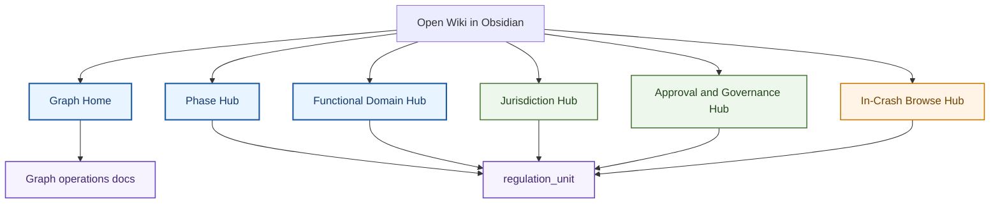
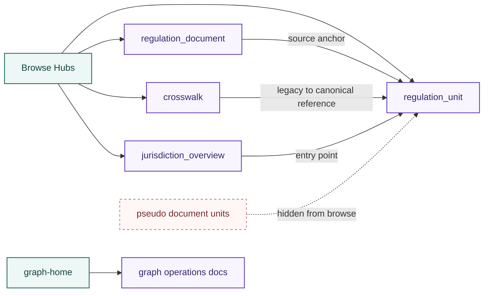
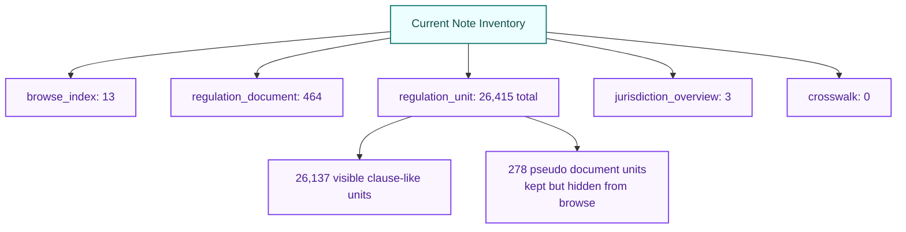

# Current Wiki Visualization

## Snapshot
- generated_at: 2026-04-14
- generator: `python tools/build_obsidian_graph_layer.py --project-root .`
- role: official tracked current snapshot
- git_contract: committed generated artifact
- browse_axis: visualization
- canonical_global_browse_hubs: 5
- graph_cluster_hubs: 6
- regulation_documents: 464
- regulation_units_total: 26,415
- regulation_units_visible: 26,137
- pseudo_document_units_hidden: 278

> [!abstract] Quick Start
> 1. Start with [[indexes/graph-home|Graph Home]] for graph-layer operations and validation context.
> 2. Start with [[indexes/phase-hub|Phase Hub]] or [[indexes/functional-domain-hub|Functional Domain Hub]] for canonical browse-first navigation.
> 3. Use [[indexes/jurisdiction-hub|Jurisdiction Hub]] when the question is jurisdiction-first.
> 4. Use [[indexes/approval-and-governance-hub|Approval and Governance Hub]] for approval, conformity, surveillance, recall, and governance text.
> 5. Treat `regulation_document` as a source anchor and `regulation_unit` as the real answer unit.

## Why This Hub Exists
> [!info] This note is a builder-owned committed current snapshot generated from the live wiki note inventory.
> Open this page in Obsidian to render the Mermaid diagrams and use it as the current structural snapshot before drilling into individual hubs.
> `.\scripts\wiki.ps1 graph-refresh` regenerates this page as part of the official graph surface set.

> [!warning] Read This Correctly
> `Phase` and `functional_domain` remain the primary global browse surfaces.
> `In-Crash Browse` is a secondary browse aid, not the ontology root.
> `[[indexes/graph-home|Graph Home]]` is the operator entrypoint for graph-layer refresh, validation, and review docs.

## Browse View
### Navigation Priority


### Knowledge Topology


### Current Corpus Shape


### Open These First
- Graph operations:
  - [[indexes/graph-home|Graph Home]]
- Primary global browse:
  - [[indexes/phase-hub|Phase Hub]]
  - [[indexes/functional-domain-hub|Functional Domain Hub]]
- Supporting browse:
  - [[indexes/jurisdiction-hub|Jurisdiction Hub]]
  - [[indexes/approval-and-governance-hub|Approval and Governance Hub]]
- Secondary browse only:
  - [[indexes/in-crash-browse-hub|In-Crash Browse Hub]]
- Root entrypoints:
  - [index.md](/D:/vscode/4__wiki__obsidian__upstream_safe_patch/index.md)
  - [docs/operations/INDEX.md](/D:/vscode/4__wiki__obsidian__upstream_safe_patch/docs/operations/INDEX.md)

> [!tip] Reading Rule
> Use this page as a live structural snapshot, not as a hand-maintained planning memo.
> For graph-specific operations, start with `Graph Home`; for canonical browsing, start with `Phase Hub` or `Functional Domain Hub`.

## Dataview
### Browse Hub Listing
```dataview
TABLE file.link, browse_axis, updated
FROM "wiki/indexes"
WHERE note_type = "browse_index"
SORT file.name ASC
```

### Live Note Inventory
```dataview
TABLE WITHOUT ID note_type AS "Note Type", length(rows) AS "Count"
FROM "wiki"
GROUP BY note_type
SORT length(rows) DESC
```
