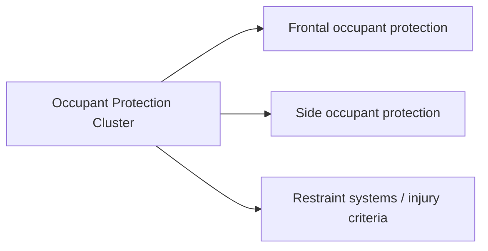

# Occupant Protection Cluster

## Snapshot
- cluster: `occupant-protection`
- graph_group: hub
- graph_ready: true

## Why This Hub Exists
- This hub gathers graph-ready concepts and selected regulations for the `occupant-protection` semantic neighborhood.

## Browse View
- Use this note as the cluster entry point for Local Graph exploration.

## Cluster Scope
- cluster: `occupant-protection`
- planned_concepts_backlog: none

## Readability Note
- This hub remains intentionally unsplit in V1.2 because the current density reflects a coherent occupant-protection neighborhood rather than noisy overlinking.

## Subgroups
### Frontal Occupant Protection
- [[concepts/concept-frontal-impact-protection|Frontal Impact Protection]]
- [[regulation_documents/xml_fmvss-571-208|§ 571.208 Standard No. 208; Occupant crash protection.]]
- [[regulation_documents/xml_kmvss-kmvss_art_102_153|조문 102 고정벽정면충돌 안전성]]
- [[regulation_documents/pdf_ece-ece_r137_un_regulation_no-_137_-_rev-1_-_frontal_impact_with_focus_on_restraint_systems_rev0_english|ECE R137 UN Regulation No. 137 - Rev.1 - Frontal impact with focus on restraint systems Rev0 English]]

### Side Occupant Protection
- [[concepts/concept-side-impact-protection|Side Impact Protection]]
- [[regulation_documents/xml_fmvss-571-214|§ 571.214 Standard No. 214; Side impact protection.]]
- [[regulation_documents/xml_kmvss-kmvss_art_102_154|조문 102 기둥측면충돌 안전성]]
- [[regulation_documents/pdf_ece-ece_r95_un_regulation_no-_95_-_rev-2_-_lateral_collision_protection_rev0_english|ECE R95 UN Regulation No. 95 - Rev.2 - Lateral collision protection Rev0 English]]

### Restraint Systems and Injury Criteria
- [[concepts/concept-occupant-protection|Occupant Protection]]
- [[concepts/concept-restraint-systems|Restraint Systems]]
- [[concepts/concept-injury-criteria|Injury Criteria]]
- [[concepts/concept-child-restraint-systems|Child Restraint Systems]]
- [[regulation_documents/xml_kmvss-kmvss_art_102_151|조문 102 충돌 시의 승객보호]]

## Mermaid Summary


## Seed Concepts
- [[concepts/concept-occupant-protection|Occupant Protection]]
- [[concepts/concept-frontal-impact-protection|Frontal Impact Protection]]
- [[concepts/concept-side-impact-protection|Side Impact Protection]]
- [[concepts/concept-restraint-systems|Restraint Systems]]
- [[concepts/concept-injury-criteria|Injury Criteria]]
- [[concepts/concept-child-restraint-systems|Child Restraint Systems]]

## Seed Regulations
- [[regulation_documents/xml_fmvss-571-208|§ 571.208 Standard No. 208; Occupant crash protection.]]
- [[regulation_documents/xml_fmvss-571-214|§ 571.214 Standard No. 214; Side impact protection.]]
- [[regulation_documents/xml_kmvss-kmvss_art_102_151|조문 102 충돌 시의 승객보호]]
- [[regulation_documents/xml_kmvss-kmvss_art_102_153|조문 102 고정벽정면충돌 안전성]]
- [[regulation_documents/xml_kmvss-kmvss_art_102_154|조문 102 기둥측면충돌 안전성]]
- [[regulation_documents/pdf_ece-ece_r137_un_regulation_no-_137_-_rev-1_-_frontal_impact_with_focus_on_restraint_systems_rev0_english|ECE R137 UN Regulation No. 137 - Rev.1 - Frontal impact with focus on restraint systems Rev0 English]]
- [[regulation_documents/pdf_ece-ece_r95_un_regulation_no-_95_-_rev-2_-_lateral_collision_protection_rev0_english|ECE R95 UN Regulation No. 95 - Rev.2 - Lateral collision protection Rev0 English]]

## Dataview
```dataview
TABLE file.link, graph_group, cluster
FROM "wiki"
WHERE contains(tags, "graph-ready") AND cluster = "occupant-protection"
SORT graph_group ASC, file.name ASC
```

<!-- BEGIN GENERATED GRAPH LAYER -->
### Neighbor Clusters
- [[indexes/graph-cluster-structural-retention-and-egress|Structural Retention and Egress Cluster]]
- [[indexes/graph-cluster-approval-and-governance|Approval and Governance Cluster]]
<!-- END GENERATED GRAPH LAYER -->
